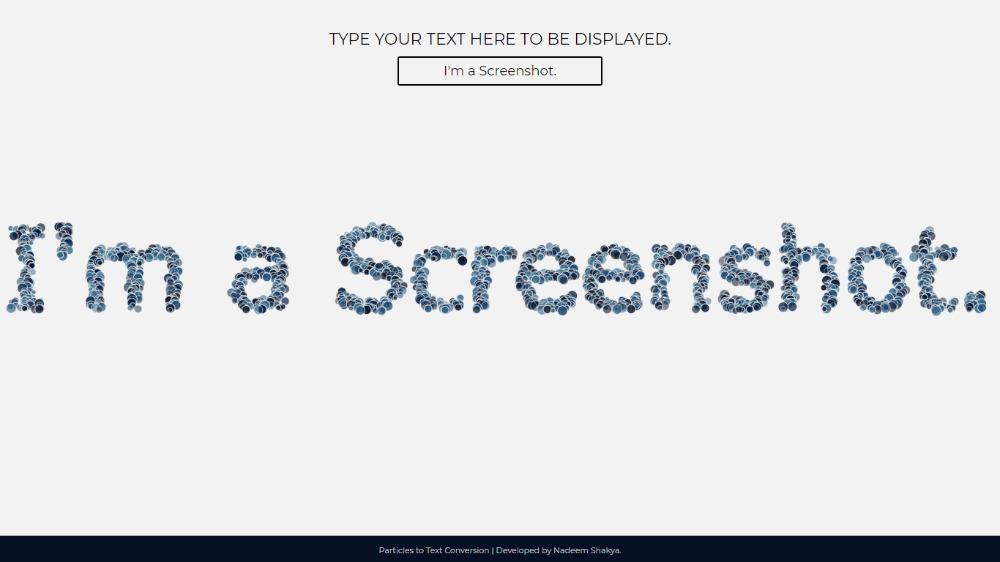

# Text-to-Point-to-Text-Conversion-Animation
Here I'll trying to create text using particles in the browser canvas using HTML 5 Canvas and JavaScript.

* An animation where Random bubbles come together to form the text you provided as an input.
* Object interaction with image data of the canvas.

### DEMO

<https://nadeemshakya.github.io/Text-to-Point-to-Text-Conversion-Animation/>

### SCREENSHOT

